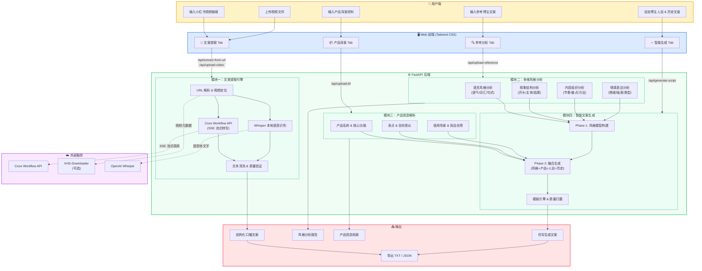
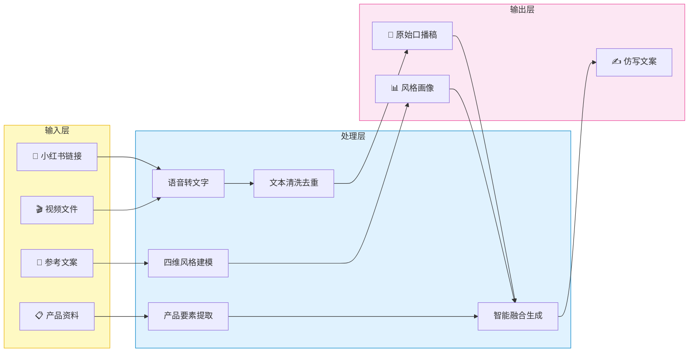

# 小红书视频文案提取与智能生成工具 — 系统架构图

## 整体业务流程

```mermaid
flowchart TB
    subgraph USER["👤 用户端"]
        direction TB
        U1["输入小红书视频链接"]
        U2["上传视频文件"]
        U3["输入参考博主文案"]
        U4["输入产品背景资料"]
        U5["设定博主人设 & 历史文章"]
    end

    subgraph FRONTEND["🖥️ Web 前端 (Tailwind CSS)"]
        direction TB
        T1["📝 文案提取 Tab"]
        T2["🔍 参考分析 Tab"]
        T3["📦 产品背景 Tab"]
        T4["✨ 智能生成 Tab"]
    end

    subgraph BACKEND["⚙️ FastAPI 后端"]
        direction TB

        subgraph EXTRACT["模块一：文案提取引擎"]
            E1["URL 解析 & 视频定位"]
            E2["Coze Workflow API\n(SSE 流式转写)"]
            E3["Whisper 本地语音识别"]
            E4["文本清洗 & 质量验证"]
        end

        subgraph ANALYZE["模块二：多维风格分析"]
            A1["语言风格分析\n(语气/词汇/句式)"]
            A2["叙事结构分析\n(开头/主体/结尾)"]
            A3["内容组织分析\n(节奏/重点/方法)"]
            A4["情感表达分析\n(情绪/强度/类型)"]
        end

        subgraph PRODUCT["模块三：产品信息解析"]
            P1["产品名称 & 核心功能"]
            P2["卖点 & 目标受众"]
            P3["使用场景 & 竞品优势"]
        end

        subgraph GENERATE["模块四：智能文案生成"]
            G1["Phase 1: 风格模型构建"]
            G2["Phase 2: 融合生成\n(风格+产品+人设+历史)"]
            G3["模板引擎 & 质量打磨"]
        end
    end

    subgraph EXTERNAL["☁️ 外部服务"]
        EX1["Coze Workflow API"]
        EX2["XHS-Downloader\n(可选)"]
        EX3["OpenAI Whisper"]
    end

    subgraph OUTPUT["📤 输出"]
        O1["结构化口播文案"]
        O2["风格分析报告"]
        O3["产品信息档案"]
        O4["仿写生成文案"]
        O5["导出 TXT / JSON"]
    end

    %% 用户 → 前端
    U1 --> T1
    U2 --> T1
    U3 --> T2
    U4 --> T3
    U5 --> T4

    %% 前端 → 后端
    T1 -->|"/api/extract-from-url\n/api/upload-video"| EXTRACT
    T2 -->|"/api/upload-reference"| ANALYZE
    T3 -->|"/api/upload-bf"| PRODUCT
    T4 -->|"/api/generate-script"| GENERATE

    %% 后端内部流转
    E1 --> E2
    E1 --> E3
    E2 --> E4
    E3 --> E4

    A1 --> G1
    A2 --> G1
    A3 --> G1
    A4 --> G1

    P1 --> G2
    P2 --> G2
    P3 --> G2

    G1 --> G2
    G2 --> G3

    %% 后端 → 外部服务
    E2 -.->|"SSE 流式调用"| EX1
    E1 -.->|"视频元数据"| EX2
    E3 -.->|"语音转文字"| EX3

    %% 后端 → 输出
    E4 --> O1
    ANALYZE --> O2
    PRODUCT --> O3
    G3 --> O4
    O1 --> O5
    O4 --> O5

    %% 样式
    style USER fill:#fef3c7,stroke:#f59e0b,stroke-width:2px
    style FRONTEND fill:#dbeafe,stroke:#3b82f6,stroke-width:2px
    style BACKEND fill:#f0fdf4,stroke:#22c55e,stroke-width:2px
    style EXTERNAL fill:#fae8ff,stroke:#a855f7,stroke-width:2px
    style OUTPUT fill:#ffe4e6,stroke:#f43f5e,stroke-width:2px
    style EXTRACT fill:#ecfdf5,stroke:#10b981,stroke-width:1px
    style ANALYZE fill:#ecfdf5,stroke:#10b981,stroke-width:1px
    style PRODUCT fill:#ecfdf5,stroke:#10b981,stroke-width:1px
    style GENERATE fill:#ecfdf5,stroke:#10b981,stroke-width:1px
```

## 核心数据流

```mermaid
flowchart LR
    subgraph INPUT["输入层"]
        I1["🔗 小红书链接"]
        I2["🎬 视频文件"]
        I3["📄 参考文案"]
        I4["📋 产品资料"]
    end

    subgraph PROCESS["处理层"]
        P1["语音转文字"]
        P2["文本清洗去重"]
        P3["四维风格建模"]
        P4["产品要素提取"]
        P5["智能融合生成"]
    end

    subgraph OUTPUT["输出层"]
        O1["📝 原始口播稿"]
        O2["📊 风格画像"]
        O3["✍️ 仿写文案"]
    end

    I1 --> P1
    I2 --> P1
    P1 --> P2
    P2 --> O1

    I3 --> P3
    P3 --> O2

    I4 --> P4

    O1 --> P5
    O2 --> P5
    P4 --> P5
    P5 --> O3

    style INPUT fill:#fef9c3,stroke:#eab308
    style PROCESS fill:#e0f2fe,stroke:#0284c7
    style OUTPUT fill:#fce7f3,stroke:#ec4899
```
